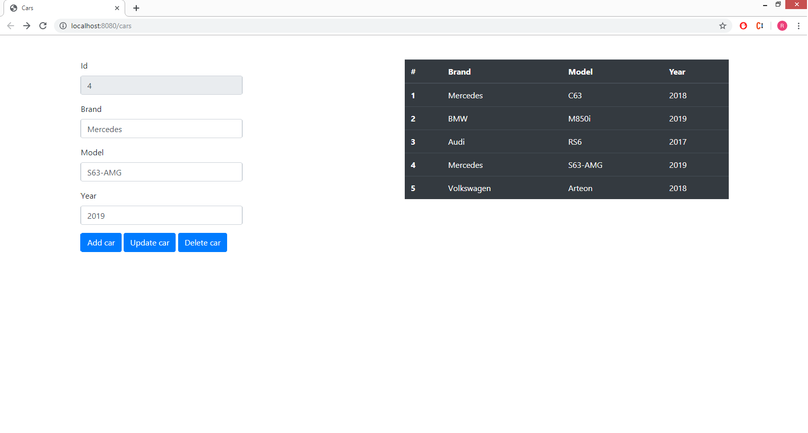

# SpringMVC-MySQL-JdbcTemplate

CRUD basic examples with Spring MVC + MySQL + Jdbc Template

## Tools
* Build Tool: Maven
* Backend: SpringMVC 5.1.8
* Database: MySQL
* Frontend: JavaScript JSP Bootstrap
* Web Server: Tomcat 9.0.17
* IDE: IntelliJ IDEA Ultimate
* Test: Mockito & JUnit

## Features
* CRUD operations for managment of cars
* Spring MVC Annotation-based configuration
* Unit Tests with Mockito
* Data access with JDBC
